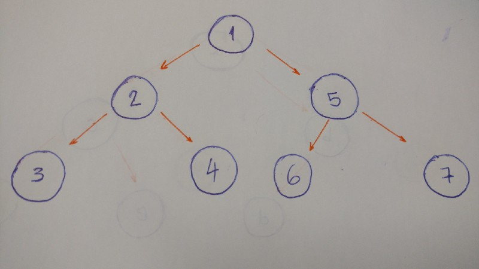

## Depth-First Search (DFS)

**DFS** explores a path all the way to a leaf before backtracking and exploring another path

- Lets' take a look at an example with this type of traversal:



The result for this algorithm will be 1-2-3-4-5-6-7.

Breakdown:

1. Start at the `root (1)`
2. Go to the `left_child (2)`
3. Then go to the `left_child (3)` (This node doesn't have any children).
4. Backtrack and go the `right_child (4)` (this node doesn't have any children)
5. Backtrack to the `root` node and go to the `right_child (5)`.
6. Go to the `left_child (6)` (this node doesn't have any children).
7. Backtrack and go to the `right_child (7)` (this node dosn't have any children).
8. Done

### Types of DFS:

- pre-order
- in-order
- post-order

### Pre-order

Steps:

1. Print the vaule of the `node`.
2. Go to the `left child` and print it. This is if, and only if, it has a left child.
3. Go the `right child` and print it. This is if, and only if, it has a `right child`.


```python
def pre_order(self):
    print(self.value)

    if self.left_child:
        self.left_child.pre_order()

    if self.right_child:
        self.right_child.pre_order()
```


### In-order

The result of the in-order algorithm for this `tree` is: 3-2-4-1-6-5-7

- The left first, the middle second, and the right last.

Now let's code.

```python
def in_order(self):
    if self.left_child:
        self.left_child.in_order()

    print(self.value)

    if self.right_child:
        self.right_child.in_order()
```

1. Go to the `left child` and print tit. This is if, and only if, it has a `left child`.
2. Print the `node`'s value.
3. Go to the `right child` and print it. This is if, and only if, it has a `right child`.


### Post-order

The result of the `post-order` algorithm for this `tree`: example: 3-4-2-6-7-5-1.

- The left first, the right second and the middle last.

```python
def post_order(self):
    if self.left_child:
        self.left_child.post_order()

    if self.right_child:
        self.right_child.post_order()

    print(self.value)
```

1. Go to the `left_child` and print it. This is if, and only it, it has a `left child`.
2. Go to the `right child` and pritn it. This is if, and only if, it has a `right child`.
3. Print the `node`'s value.


[<<< Traversal](101-traversal.md) .. [BFS >>>](103-BFS.md)