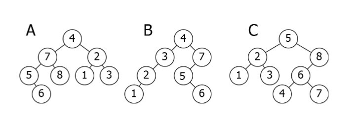
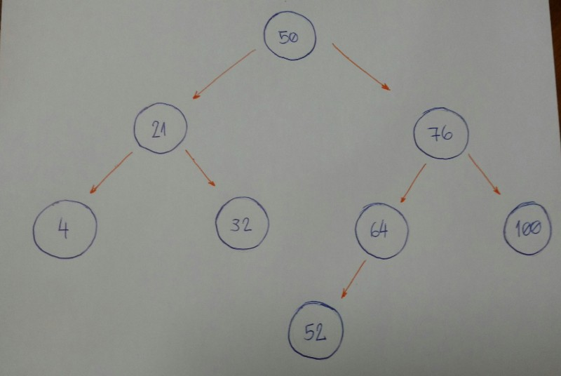
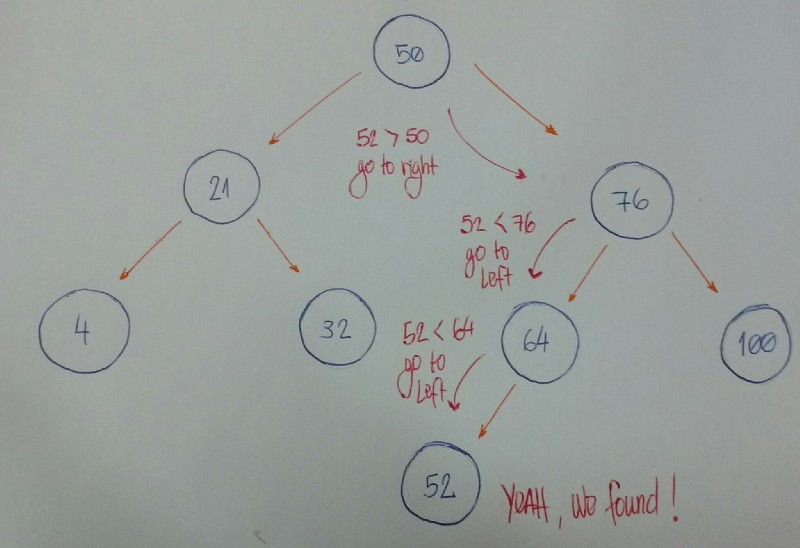

# Binary Search Tree

A Binary Search Tree is sometimes called ordered or sorted binary trees, and it keeps it values in sorted order, so that lookup and other operations can use the principle of binary search.

**An important property of a `Binary Serach Tree` is that the value of a `Binary Search Tree` node is larger that then the value of the offspring  of its `left child`, but smaller than the value of the offspring of its `right child`.**



Here is a breakdown of the above illustration:

- **A** is inverted, The `subtree` 7-5-8-6 needs to be on the right side, and the `subtree` 2-1-3 needs to be on the left.
- **B** is the only correct option. It satisfies the `Binary Search Tree` property.
- **C** has one problem: the `node` with the value 4. It needs to be on the left side of the `root` because it is smaller than 5.

## Coding Binary Search Tree!

What will we see here?

- We will insert new nodes,
- search for a value, 
- delete nodes
- and the balance of the `tree`.


### Insetion: adding new nodes to our tree

Image that we have an empty `tree` and we want to add new `nodes` with the following values in this order: 50, 76, 21, 4, 32, 100, 64, 52.

- The first thing we need to know is if 50 is the root of our tree.

- We can now start inserting `node` by `node`.

    - 76 is greater thatn 50, so insert 76 on the right side.
    - 21 is smaller than 50, so insert 21 on the left side.
    - 4 is smaller than 50. `Node` with value `50` has a `left child` 21. Since 4 is smaller than 21, insert it on the left side of this `node`.
    - 32 is smaller then 50. `Node` with value 50 has a `left child` 21. Since 32 is greater than 21, insert 32 on the right side of this `node`.
    - `100` is greater than `50`. Node with value 50 has a `right child` 76. Since 100 is greater than 76, insert 100 on the right side of this `node`.
    - 64 is greater than 50. Node with value 50 has a `right child` 76. Since 64 is smaller than 76, insert 64 on the left side of this `node`.
    - 52 is greater than 50. Node with value 50 has a `right child` 76. Since 52 is smaller than 76, node with value 76 has a `left child` 64. 52 is smaller than 64, so insert 54 on the left side of this `node`.



Let break it down.

1. Is the new `node` value greater or smaller then the current `node`?
2. If the value of the new `node` is greater than the current `node,` go to the right `subtree`. It the current node doesn't have a `right child`, insert it there, or else backtrack to step #1.
3. If the value of the new `node` is smaller than the current `node`, go to the left `subtree`. If the current node doesn’t have a `left child`, insert it there, or else backtrack to step #1.
4. We did not handle special cases here. When the value of a new `node` is equal to the current value of the `node`, use rule number 3. Consider inserting equal values to the left side of the `subtree`.

Now let's code it:

```python
class BinarySearchTree:
    def __init__(self, value):
        self.value = value
        self.left_child = None
        self.right_child = None

    def insert_node(self, value):
        if value <= self.value and self.left_child:
            self.left_child.insert_node(value)
        elif value <= self.value:
            self.left_child = BinarySearchTree(value)
        elif value > self.value and self.right_child:
            self.right_child.insert_node(value)
        else:
            self.right_child = BinarySearchTree(value)
```


### Let's search for the node value... Or not...

Defining **Insertion algorithm**. 
    - First we hve our `root node.
    - All the left `subtree nodes` will have smaller values than the `root node`.
    - And all the right `subtree nodes` will have values greater than the `root node`.

Let's take a look at an example:

- Image that we have this tree:


- Now we want to known if we have a node based on value 52.



- Let’s break it down.

    - We start with the root node as our current node. Is the given value smaller than the current node value? If yes, then we will search for it on the left subtree.
    - Is the given value greater than the current node value? If yes, then we will search for it on the right subtree.
    - If rules #1 and #2 are both false, we can compare the current node value and the given value if they are equal. If the comparison returns true, then we can say, “Yeah! Our tree has the given value,” otherwise, we say, “Nooo, it hasn’t.”

- Now let's code it.

```python
class BinarySearchTree:
    def __init__(self, value):
        self.value = value
        self.left_child = None
        self.right_child = None

    def find_node(self, value):
        if value < self.value and self.left_child:
            return self.left_child.find_node(value)
        if value > self.value and self.right_child:
            return self.right_child.find_node(value)

        return value == self.value
```

- Let's create our `Binary Search Tree` by initializing the `root node` with the value 15.

```python
bst = BinarySearchTree(15)

bst.insert_node(10)
bst.insert_node(8)
bst.insert_node(12)
bst.insert_node(20)
bst.insert_node(17)
bst.insert_node(25)
bst.insert_node(19)
```

- For each inserted `node`, we will test if our `find_node` method really works.

```python
print(bst.find_node(15)) # True
print(bst.find_node(10)) # True
print(bst.find_node(8)) # True
print(bst.find_node(12)) # True
print(bst.find_node(20)) # True
print(bst.find_node(17)) # True
print(bst.find_node(25)) # True
print(bst.find_node(19)) # True
```

- it works for these given value! Let's test for a value that doesn't exit in out `Binary Search Tree`.


```python
print(bst.find_node(0)) # False
```

### Deletion: removing and organizing

